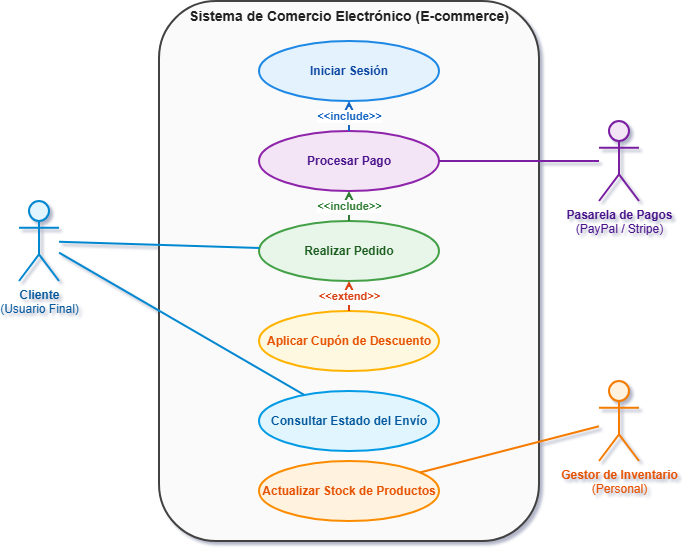

# Documentación de Arquitectura: Casos de Uso

## 1. Descripción del Módulo
El presente documento define los requisitos funcionales del sistema.

## 2. Diagrama UML de Casos de Uso

## 3. Especificación de Relaciones
- *Relaciones:* Detalle de los casos de uso.
